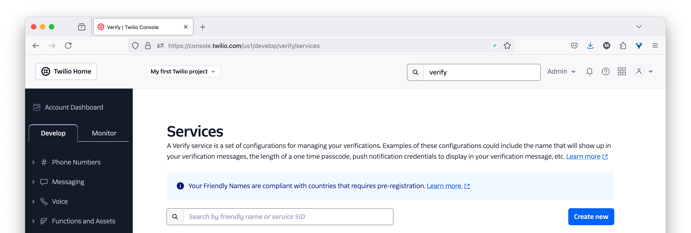
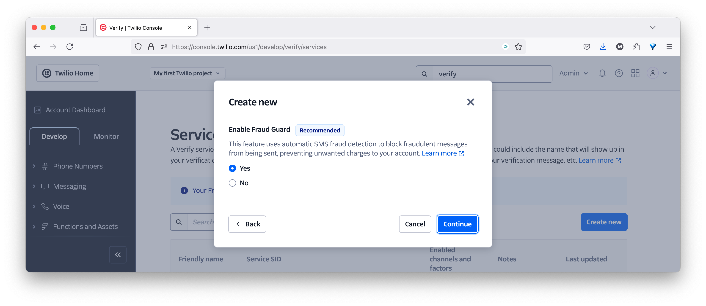

# SMS Phone Verification with PHP

This is a small web application built around the Mezzio Skeleton is a basic SMS phone verification example with PHP and Twilio.

## How Does It Work?

* It uses [Twilio Verify][twilio_verify_url] to verify phone numbers, and to add an additional layer of security.
  This helps prevent fraudulent users from registering with your business.
* It renders a UI to create an account on a (fictional) website, where the customer would enter their username, password, and phone number.
* Following a successful submission, it will send the customer an SMS with a verification code.
* The customer will be asked to enter the code into a second form to verify the code.
* If the code is successfully verified, then the user's fictitious account is considered created.

There is a bit more to it, but these are the essential points.

## Prerequisites

To use this application, you're going to need:

- A Twilio account (either free or paid) with a [Twilio phone number][twilio_phone_number_setup_url] that can handle phone calls.
  If you are new to Twilio, [create a free account][twilio_referral_url].
- PHP 8.3
- [Composer][composer_url] installed globally

## ⚡️ Quick Start

### Set up the Application

Firstly, clone this repository and change into the cloned directory with the following commands:

```bash
git clone git@github.com:settermjd/block-spam-calls-php.git
cd block-spam-calls-php
```

Then, install PHP's dependencies:

```bash
composer install
```

#### Configure the application

After that, you need to set the environment variables which the application requires.
These are your **Twilio Account SID** and **Auth Token**.
To do that, first copy _.env.example_ (which has the variables defined but not set) as _.env_.

```bash
cp .env.example .env
```

Then, you need to retrieve your Twilio credentials from the **Account Info** panel in [the Twilio Console Dashboard][twilio_console_url].
After you've retrieved them, set the values for `TWILIO_ACCOUNT_SID` and `TWILIO_AUTH_TOKEN` in  _.env_ with the credentials that you just copied.

Following that, create a Verify V2 service.



First, open [the Twilio Console][twilio_console_url] in your browser of choice and navigate to **Explore products > Verify >** [Services][twilio_console_verify_services_url].
There, click **Create new**.


In the **_Create new_** [Verify Service] form that appears, provide a **Friendly name**, enable the **SMS** verification channel, and click **Continue**.



Following that, click Continue in the Enable Fraud Guard stage.


Now, you'll be on the Service settings page for your new Verify Service.
Copy the **Service SID** and set it as the value of `TWILIO_VERIFICATION_SID` in _.env_.

### Start the Application

Now, start the application using the following command:

```bash
composer serve
```

### Test the Application


To test the application, open http://localhost:8080 in your browser of choice.
There, enter a username, password, and your phone number and click **Request Verification Code**.


You'll be redirected to the code verification form.
Submit the verification code that you received via SMS.
If verification was successful, you'll be redirected to the code verification form.

## Contributing

If you want to contribute to the project, whether you have found issues with it or just want to improve it, here's how:

- [Issues][issues_url]: ask questions and submit your feature requests, bug reports, etc
- [Pull requests][pull_requests_url]: send your improvements

## Resources

Find out more about the project on [CodeExchange][code-exchange-url].

## Did You Find The Project Useful?

If the project was useful and you want to say thank you and/or support its active development, here's how:

- Add a GitHub Star to the project
- Write an interesting article about the project wherever you blog

## License

[MIT](./LICENSE)

## Disclaimer

No warranty expressed or implied. Software is as is.

[code-exchange-url]: https://www.twilio.com/code-exchange/sms-phone-verification
[composer_url]: https://getcomposer.org
[issues_url]: https://github.com/settermjd/sms-phone-verification-php/issues
[pull_requests_url]: https://github.com/settermjd/sms-phone-verification-php/pulls
[mezzio-url]: https://docs.mezzio.dev/mezzio/
[twilio]: https://www.twilio.com
[twilio_console_url]: https://www.twilio.com/console
[twilio_console_verify_services_url]: https://console.twilio.com/us1/develop/verify/services
[twilio_verify_url]: https://www.twilio.com/en-us/user-authentication-identity/verify
[mit_license_url]: http://www.opensource.org/licenses/mit-license.html